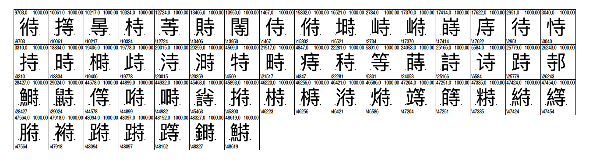

# IDS Tools
Tools for querying IDS (Ideographic Description Sequence) of ideographs.

## Installation
### Homebrew
`brew install jimmymasaru/repo/ids-tools`
### Manual Install
Node.js is required to run IDS tools.
You can just clone/download this repository. After running `init.sh` to initialize you can run `idsquery`.

## License
GPLv2

## Usage
### Decomposing an Ideograph
```
idsquery char [character]
idsquery char 鮮
```

### Looking up Ideographs by Components
```
idsquery comp [component]
idsquery comp 寺
```
#### Output
`侍偫塒峙崻嵵庤待恃持時榯歭洔溡特畤痔秲等蒔詩诗跱邿鰣鼭㣥㩐㫭㭙䓁䝰䦙𠍰𠎬𠗭𠟚𠱾𠸤𠺮𠾡𡀗𡮲𡻄𢔽𢡩𢱜𣊒𣖖𣙦𣛆𣹘𣻞𤋵𤚟𤨅𤲔𤲵𤸟𥢜𥩳𥪸𥮻𥱯𥹩𥻣𥻵𦃀𦅯𦞒𦱎𦱰𦵟𦸎𧎋𧎬𧛶𧠴𧶱𨂄𨃉𨃌𨃯𨅸𨨲𨫉𨬻𩶬𩹭𪀔𪃝𪕵𪗺𪧸𪮛𪰛𪰰𪿚𫁧𫂨𫄋𫅌𫊵𫮨𫴶𫸺𫹦𬃿𬌣𬌦𬠟𬰈𬵣𬼑𬾸𭉪𭊬𭎒𭝿𭷅𮆠𮆩𮖴𮥂`

### Generating PDF
[AFDKO](https://github.com/adobe-type-tools/afdko) is required.
```
idsquery pdf [component] -o [PDF filename] -f [font file] -i [font index for TTC, 0 if ommitted]
idsquery pdf 寺 -o 寺.pdf -f /System/Library/Fonts/PingFang.ttc -i 2
idsquery pdf 名 -o 名.pdf -f /Library/Fonts/KozGoPr6N-Regular.otf
```
#### Output


